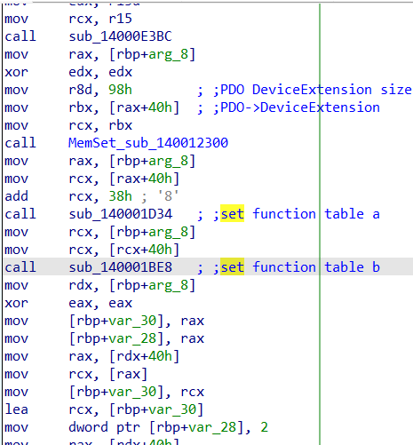
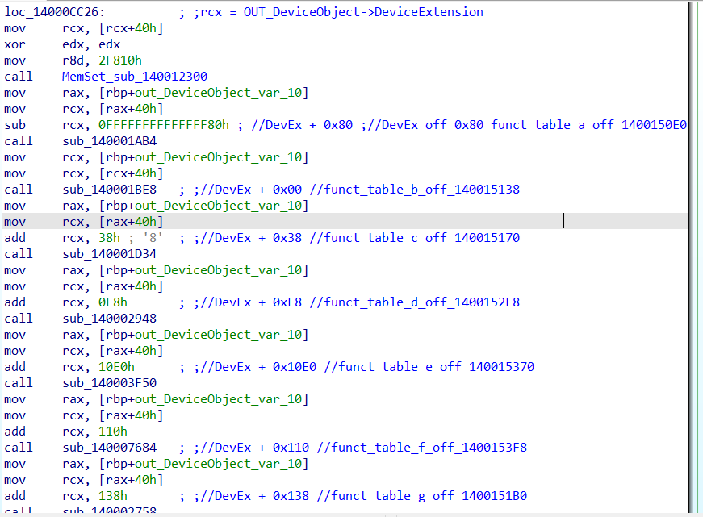
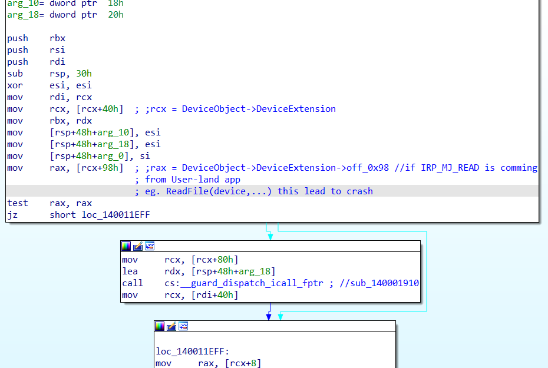

//AsusPTPFilter.sys (driver version: 11.0.0.30, file version: 11.0.0.25) 
 

Tym razem powinienem chyba zacząć od początku, od czegoś, co możemy określić jako cykl życia sterownika Windows. 
Podczas uruchamiania systemu operacyjnego, menadżer PNP wysyła do sterownika (UPNP) żądanie IRP_MJ_PNP. 
Obsługa żądania IRP_MJ_PNP tworzy obiekt urządzenia (_DEVICE_OBJECT) niższego poziomu w stosie urządzeń - w tym wypadku HID - nazwijmy urządzenie "PDO" 
oraz między innymi odpowiada za inicjalizacje struktury _DEVICE_OBJECT->DeviceExtensions wielkości 0x98 bajtów.
  
 

 
 
W tym przypadku zarówno dla obiektów wyższego poziomu (nazwijmy je "FDO") jak i obiektów "PDO" struktury _DEVICE_OBJECT->DeviceExtensions są ważne, ponieważ w nich są przechowywane wskaźniki do funkcji,  
które są wywoływane via CFG w wielu miejscach kodu sterownika.  
Po zakończeniu obsługi żądania IRP_MJ_PNP, w końcu wywoływana jest procedura AddDevice (DriverObject->DriverExtension->AddDevice).  
Ta procedura tworzy obiekt urządzenia "FDO" (_DEVICE_OBJECT), dołącza go do swojego obiektu urządzenia rodzica ("PDO") oraz inicjalizuje _DEVICE_OBJECT->DeviceExtensions o wielkości 0x2F810.
 
 

 
 
Oczywiście występują tu różnice w wielkościach struktury DeviceExtension między obiektami "PDO" i "FDO". 
Kiedy sterownik otrzymuje żądanie IRP_MJ_READ z aplikacji trybu użytkownika to sterowanie w końcu trafia do funkcji sub_140011EBC. Ta funkcja przy pomocy CFG 
próbuje wywołać procedurę ("PDO") DeviceObject->DeviceExtension->off_0x98, o ile umiem liczyć do 0x98,  
to odwołując się do pamięci, której rozmiar alokacji jest równy 0x98 pod przesunięciem 0x98 dla 8-bajtowego typu danych odwołujemy się do pamięci poza zakresem przekroczonym o 8 bajtów.
 
 

 
 
Nie zależnie jednak od tego czy potraktujemy tę podatność jako "Out-of-bounds read" czy "NULL pointer dereference" to w chwili obecnej, we współczesnych systemach Windows jest ona sama w sobie "nie-exploitowalna",  
w tym sensie, że nie możemy jej wykorzystać do eskalacji uprawnień, chyba że będziemy w stanie ominąć mechanizm "Null Page Guard" - jest to możliwe by default w systemach 32-bitowych z zainstalowanym podsystemem NTVDM - lub będziemy w stanie uzyskać kontrolę nad wartością pamięci spod adresu (PDO) DeviceObject->DeviceExtension->off_0x98. 
W przeciwnym wypadku możemy wyłączenie w efektowny sposób wysadzić system operacyjny w kosmos.  
Z formalnego punktu widzenia błąd nawet w przypadku zwykłego "BSOD-a" jest podatnością, ponieważ oddziałuje na dostępność systemu z poziomu nisko uprzywilejowanego konta użykownika. 
W przypadku laptopów gamingowych to raczej nie jest problem, chyba, że ktoś właśnie bierze udział w turnieju, dostał BSOD-em i przegrał 1000000 dolarów w CS-a :). 
Natomiast nie wiem, w jakich innych produkatach ASUS-a wykorzystywany jest jeszcze ten sterownik, ani jak wygląda sprawa w przypadku innych systemów operacyjnych niż MS Windows, oczywiście są jeszcze kwestie systemów Windows "pre-8",
w których błąd jest exploitowalny w domyślnej konfiguracji.
<h3>CRASH log:</h3>
<pre>
7: kd> !devobj @rcx
Device object (ffffa60cf91a0d70) is for:
 AsusTP \Driver\AsusPTPDrv DriverObject ffffa60cf8b8b7b0
Current Irp 00000000 RefCount 1 Type 00000022 Flags 00000054
SecurityDescriptor ffff91083e334aa0 DevExt ffffa60cf91a0ec0 DevObjExt ffffa60cf91a0f58 
ExtensionFlags (0x00000800)  DOE_DEFAULT_SD_PRESENT
Characteristics (0x00000100)  FILE_DEVICE_SECURE_OPEN
Device queue is not busy.

7: kd> dq rcx
ffffa60c`f91a0ec0  ffffa60c`f8df82e0 fffff805`7ed31910
ffffa60c`f91a0ed0  fffff805`7ed31930 fffff805`7ed31b10
ffffa60c`f91a0ee0  fffff805`7ed31b40 fffff805`7ed31b60
ffffa60c`f91a0ef0  fffff805`7ed31b90 ffffa60c`f8c9cd50
ffffa60c`f91a0f00  fffff805`7ed31910 fffff805`7ed31930
ffffa60c`f91a0f10  fffff805`7ed31c40 fffff805`7ed31c70
ffffa60c`f91a0f20  fffff805`7ed31c90 fffff805`7ed31cc0
ffffa60c`f91a0f30  fffff805`7ed31ce0 fffff805`7ed31b40
7: kd> dq rcx + 0x98
ffffa60c`f91a0f58  00000000`0000000d ffffa60c`f91a0d70
ffffa60c`f91a0f68  00000000`00000000 00000000`00000000
ffffa60c`f91a0f78  00000000`00000800 00000000`00000000
ffffa60c`f91a0f88  00000000`00000000 00000000`00000000
ffffa60c`f91a0f98  00000000`00000000 00000000`00000000
ffffa60c`f91a0fa8  00000000`00000000 00000000`00000000
ffffa60c`f91a0fb8  00000000`00000000 00000000`00000000
ffffa60c`f91a0fc8  00000000`00000000 00000001`404c1e50

0: kd> g
Access violation - code c0000005 (!!! second chance !!!)
00000000`0000000d ??              ???
2: kd> kb
 # RetAddr               : Args to Child                                                           : Call Site
00 fffff802`434d1efb     : 00000000`00000000 00000000`00000000 00000000`00000000 fffff802`434ccf20 : 0xd
01 fffff802`434ccf87     : 00000000`00000000 00000000`0000060c 00000000`00000000 00000000`00000000 : AsusPTPFilter+0x11efb
02 fffff802`1fa49b05     : ffffe301`42536f49 ffffe301`fd808300 ffffa781`c8245891 00000000`00000000 : AsusPTPFilter+0xcf87
03 fffff802`1fec6470     : ffffe301`fd808300 ffffa781`c8245891 ffffe301`fe20d590 ffffe301`fe20d590 : nt!IofCallDriver+0x55
04 fffff802`1ff718b4     : 00000000`00000000 00000000`00000000 00000000`00000005 ffffe301`fe20d590 : nt!IopSynchronousServiceTail+0x1d0
05 fffff802`1ff713a3     : ffffe301`fe20d590 00000000`00000000 00000000`00000000 00000000`00000000 : nt!IopReadFile+0x4d4
06 fffff802`1fc2f608     : ffffe301`fa775080 ffffa781`c8245b60 0000002c`5276f688 00000000`00000000 : nt!NtReadFile+0xd3
07 00007ffa`506efb44     : 00007ffa`4dcbbc7b 00000000`0000000a 00007ff7`cf7ef3d0 00000000`00000001 : nt!KiSystemServiceCopyEnd+0x28
08 00007ffa`4dcbbc7b     : 00000000`0000000a 00007ff7`cf7ef3d0 00000000`00000001 00001a6d`a7af7f1e : 0x00007ffa`506efb44
09 00000000`0000000a     : 00007ff7`cf7ef3d0 00000000`00000001 00001a6d`a7af7f1e 0000002c`5276f6c0 : 0x00007ffa`4dcbbc7b
0a 00007ff7`cf7ef3d0     : 00000000`00000001 00001a6d`a7af7f1e 0000002c`5276f6c0 0000002c`5276f730 : 0xa
0b 00000000`00000001     : 00001a6d`a7af7f1e 0000002c`5276f6c0 0000002c`5276f730 00000080`00000080 : 0x00007ff7`cf7ef3d0
0c 00001a6d`a7af7f1e     : 0000002c`5276f6c0 0000002c`5276f730 00000080`00000080 00000000`00000000 : 0x1
0d 0000002c`5276f6c0     : 0000002c`5276f730 00000080`00000080 00000000`00000000 00000000`00000000 : 0x00001a6d`a7af7f1e
0e 0000002c`5276f730     : 00000080`00000080 00000000`00000000 00000000`00000000 00000000`00000000 : 0x0000002c`5276f6c0
0f 00000080`00000080     : 00000000`00000000 00000000`00000000 00000000`00000000 00000000`00000000 : 0x0000002c`5276f730
10 00000000`00000000     : 00000000`00000000 00000000`00000000 00000000`00000000 00000000`00000000 : 0x00000080`00000080
</pre>

<ul>
<li><a name="0x81032008"><b>ioctl: 0x002215A8</b></a></li>
<u>Device: UNKNOWN (0x22)</u>
 
<u>Function: 0x56a</u>
 
<u>Access: FILE_ANY_ACCESS</u>
   
<u>Method: METHOD_BUFFERED</u>
 
<u>Rozmiar bufforów: OUT == 0x00, IN == 0x438</u>
 
<u>Additional requirements:</u> None
 
 
N/A
 
<li><a name="0x81032008"><b>ioctl: 0x00221404</b></a></li>
<u>Device: UNKNOWN (0x22)</u>
 
<u>Function: 0x501</u>
 
<u>Access: FILE_ANY_ACCESS</u>
   
<u>Method: METHOD_BUFFERED</u>
 
<u>Rozmiar bufforów: OUT == 0x1024, IN == 0x00</u>
 
<u>Additional requirements:</u> None
 
 
N/A
 
<li><a name="0x81032008"><b>ioctl: 0x00221408</b></a></li>
<u>Device: UNKNOWN (0x22)</u>
 
<u>Function: 0x502</u>
 
<u>Access: FILE_ANY_ACCESS</u>
   
<u>Method: METHOD_BUFFERED</u>
 
<u>Rozmiar bufforów: OUT <= 1084, IN == 0x00</u>
 
<u>Additional requirements:</u> None
 
 
N/A
 
<li><a name="0x81032008"><b>ioctl: 0x0022140c</b></a></li>
<u>Device: UNKNOWN (0x22)</u>
 
<u>Function: 0x503</u>
 
<u>Access: FILE_ANY_ACCESS</u>
   
<u>Method: METHOD_BUFFERED</u>
 
<u>Rozmiar bufforów: OUT == 1080, IN == 0x00</u>
 
<u>Additional requirements:</u> None
 
 
N/A
 
<li><a name="0x81032008"><b>ioctl: 0x00221410</b></a></li>
<u>Device: UNKNOWN (0x22)</u>
 
<u>Function: 0x504</u>
 
<u>Access: FILE_ANY_ACCESS</u>
   
<u>Method: METHOD_BUFFERED</u>
 
<u>Rozmiar bufforów: OUT == 1080, IN == 0x00</u>
 
<u>Additional requirements:</u> None
 
 
N/A
 
<li><a name="0x81032008"><b>ioctl: 0x00221414</b></a></li>
<u>Device: UNKNOWN (0x22)</u>
 
<u>Function: 0x505</u>
 
<u>Access: FILE_ANY_ACCESS</u>
   
<u>Method: METHOD_BUFFERED</u>
 
<u>Rozmiar bufforów: N/A</u>
 
<u>Additional requirements:</u> None
 
 
N/A
 
<li><a name="0x81032008"><b>ioctl: 0x00442980</b></a></li>
<u>Device: 0x44</u>
 
<u>Function: 0xa60</u>
 
<u>Access: FILE_ANY_ACCESS</u>
   
<u>Method: METHOD_BUFFERED</u>
 
<u>Rozmiar bufforów: OUT < 0x10, IN == 0x00</u>
 
<u>Additional requirements:</u> None
 
 
N/A
 
<li><a name="0x81032008"><b>ioctl: 0x00442984</b></a></li>
<u>Device: 0x44</u>
 
<u>Function: 0xa61</u>
 
<u>Access: FILE_ANY_ACCESS</u>
   
<u>Method: METHOD_BUFFERED</u>
 
<u>Rozmiar bufforów: OUT == 0x00, IN == 0x438</u>
 
<u>Additional requirements:</u> None
 
 
N/A
 
</ul>

<b>
NTSTATUS PsSetCreateProcessNotifyRoutine( 
  [in] PCREATE_PROCESS_NOTIFY_ROUTINE NotifyRoutine = ProcessNotifyCallBack_sub_14000D0F0 
  [in] BOOLEAN                        Remove 
); 
</b>
<pre>

EPROCESS eproc;
if(SUCCESSSED(PsLookupProcessByProcessId(ProcessId, &eproc)) return ...

PSTRING dst_f_name;
PCSZ name = PsGetProcessImageFileName(&eproc);

RtlInitString(dst_f_name, name);

UNICODE_STRING dst_u_name;
RtlAnsiStringToUnicodeString(&dst_u_name, dst_f_name, TRUE);

UNICODE_STRING dst_u_s_name;
RtlInitUnicodeString(&dst_u_name, L"ptlogo.exe");

if(RtlCompareUnicodeString(dst_u_name ,dst_u_s_name) != 0) return ...

if(FDO_DeviceObject_ptr_qword_140016278 == nullptr) return ...

__guard_dispatch_icall_fptr(FDO_DeviceObject_ptr_qword_140016278->DeviceExtentions->off_0x138, &FDO_DeviceObject_ptr_qword_140016278->DeviceExtentions->off_0x138); //sub_1400024C0

RtlFreeUnicodeString(dst_u_name);

ObfDereferenceObject(eproc)

return ...;
</pre>

<h3>Wnioski:</h3>

Chcę mi się spać 😴 

<h3>Linki:</h3>

<a href="https://www.youtube.com/watch?v=ruJWjGiNm7I">Demo</a> 
<a href="https://github.com/4337/SAST-DAST-RE/blob/main/AsusPTPFilter.sys-v11.0.0.30-x64/POC/AsusPTPFilter_interface/AsusPTPFilter_interface.cpp">POC</a> 
<a href="https://github.com/4337/SAST-DAST-RE/blob/main/AsusPTPFilter.sys-v11.0.0.30-x64/AsusPTPFilter.sys.i64">IDA db</a> 

<h3>Oś czasu:</h3>

08.06.2024 - Zgłoszenie do Asus PSIRT  
23.07.2024 - Fixed in AsusPTPFilter.sys v16.0.0.27 (latest)  
23.07.2024 - Publikacja 
