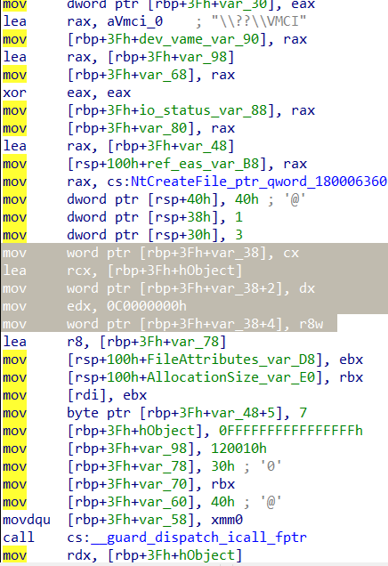

//vsock.sys 9.8.16.0 
//vsocklib_x64.dll 9.8.16.0 
//symlink: \\DosDevices\\vmci 
//         \\Device\\vmci 

 

<ul>
<li><b>IRP_MJ_CREATE</b></li>
<u>Device:  N/A</u> 
<u>Function: N/A</u> 
<u>Access: N/A</u> 
<u>Method: N/A</u> 
<u>N/A</u> 
<u>Additional requirements:</u> FILE_FULL_EA_INFORMATION 
<pre>
BYTE eas[0x30] = { 0 };
FILE_FULL_EA_INFORMATION* eap =  reinterpret_cast<FILE_FULL_EA_INFORMATION*>(&eas[0]);

eap->NextEntryOffset = 0;
eap->Flags = 0;
    eap->EaNameLength = 7;
    eap->EaValueLength = 0x20;

    union {
#pragma pack(2)
        struct EAVALUES {
            short family_;
            short type_;
            short protocol_;
        }*Ea_values;
#pragma pack(pop)
        BYTE* Raw_values;
    };                       

    Raw_values = eas + 16;

    Ea_values->family_   = 0x1c;
    Ea_values->type_     = 1; 
    Ea_values->protocol_ = 0;
</pre>
 

Aby prawidłowo zainicjalizować interfejs urządzenia musimy przekazać odpowiednie wartości FILE_FULL_EA_INFORMATION podczas tworzenia uchwytu do urządzenia.  
O ile prawidłowe wartości nagłówka FILE_FULL_EA_INFORMATION relatywnie łatwo znaleźć (funkcja Parse_EAs_sub_140003468) to z wartościami EaValues miałem mały problem. 
Na szczęście VMware udostępnia bibliotekę dll (Windows Sockets Service Provider), która eksportuje funkcję WSPStartup i inicjalizuje strukturę WSPPROC_TABLE. 
Kolejne wskaźniki do funkcji ze struktury WSPPROC_TABLE są inicjalizowane funkcjami, które komunikują się ze sterownikiem za pomocą kodów IOCTL. 
Dla nas istotne w kontekście IRP_MJ_CREATE jest to, że biblioteka dll wykorzystuje funkcje NtCreateFile która w stosunku do CreateFile umożliwia przekazanie dodatkowych parametrów (mn. EaBuffer i EaLength). 
Jeśli wylistujemy referencje do funkcji NtCreateFile w bibliotece dll to trafimy do funkcji sub_180002A30, ta funkcja tworzy uchwyt do urządzenia przekazując zainicjalizowaną strukturę 
FILE_FULL_EA_INFORMATION.  
Wartości FILE_FULL_EA_INFORMATION to kolejne 3 argumenty przekazywane do sub_180002A30. 
Funkcja sub_180002A30 inicjalizuje WSPPROC_TABLE.lpWSPSocket, a dokumentacja msdn przedstawia deklaracje WSPSocket następująco:
<pre>
SOCKET WSPSocket(int af,int type,int protocol,LPWSAPROTOCOL_INFOW lpProtocolInfo,GROUP g,DWORD dwFlags,LPINT lpErrno );
</pre>

Tak więc trzy (3) pierwsze parametry, którymi inicjalizowane są wartości FILE_FULL_EA_INFORMATION to int af = 0x1c,int type = 1, int protocol = 0. 
Jeśli nie przekażemy prawidłowych wartości FILE_FULL_EA_INFORMATION to sterownik nie inicjalizuje wskaźnika do tablicy funkcji 
(Irp->CurrentStackLocation->FileObject->FsContext->off_0x00) oraz nie ustawi wartości Irp->CurrentStackLocation->FileObject->FsContext->off_0x8 = 0xc, a to są warunki 
które muszą zostać spełnione aby część IOCTL mogła działać prawidłowo. 
Te tablice funkcji warto sobie zrzucić do pliku <a href="./Funct_Tables.txt" target="_blank"/>click.</a>  
Po odjęciu 0xD8 od przesunięcia CFG i podzieleniu wyniku na 8 uzyskamy indeks w tablicy funkcji. 

<pre>
__guard_dispatch_icall_fptr(rax=Irp->CurrentStackLocation->FileObject->FsContext->off_0x00[0x120]) //(0x120 - 0xD8) / 8 = 9 = ioctl_0x81032080_internal_handler_sub_140007E40
</pre>
 
 
<li><b>IRP_MJ_READ, IRP_MJ_WRITE</b> 
<u>Device: N/A</u> 
<u>Function: N/A</u> 
<u>Access: N/A</u> 
<u>Method: N/A</u> 
<u>Buffers size: N/A</u> 
<u>Additional requirments N/A</u> 
 

N/A
 
 
<li><b>ioctl: 0x81032080</b> 
<u>Device: 0x103</u> 
<u>Function: 0x820</u> 
<u>Access: FILE_ANY_ACCESS</u> 
<u>Method: METHOD_BUFFERED</u> 
<u>Buffers size: IN: 0xC, OUT: 0xC</u> 
<u>Additional requirments:</u> (Irp->CurrentStackLocation->DeviceIoControl->OutputBufferLength == Irp->CurrentStackLocation->DeviceIoControl->InputBufferLength) &&
                        (Irp->CurrentStackLocation->DeviceIoControl->InputBufferLength == 0x0c) && 
                        (Irp->CurrentStackLocation->FileObject->FsContext != nullptr) && 
                        (Irp->CurrentStackLocation->FileObject->FsContext->off_0x00 != nullptr) &&
                        (Irp->CurrentStackLocation->FileObject->FsContext->off_0x8 == Irp->CurrentStackLocation->DeviceIoControl->InputBufferLength) 
 						
--- 
Irp->AssociatedIrp->SystemBuffer[0] = 0xc 
Irp->AssociatedIrp->SystemBuffer[4] = OUTPUT 
Irp->AssociatedIrp->SystemBuffer[8] = (DWORD)INPUT 
---                    
<pre>
__guard_dispatch_icall_fptr(rax=Irp->CurrentStackLocation->FileObject->FsContext->off_0x00[0x120])  //ioctl_0x81032080_internal_handler_sub_140007E40
</pre>
 
 

<li><b>ioctl: 0x81032088</b> 
<u>Device: 0x103</u> 
<u>Function: 0x822</u> 
<u>Access: FILE_ANY_ACCESS</u> 
<u>Method: METHOD_BUFFERED</u> 
<u>Buffers size: IN: 0x38, OUT: 0x38</u> 
<u>Additional requirments:</u> (Irp->CurrentStackLocation->DeviceIoControl->InputBufferLength == 0x38) &&
                        (Irp->CurrentStackLocation->FileObject->FsContext != nullptr) && 
                        (Irp->CurrentStackLocation->FileObject->FsContext->off_0x00 != nullptr) &&
                        (Irp->CurrentStackLocation->FileObject->FsContext->off_0x8 == 0xc) 
 
--- 
WSPListen,  
WSPRecvDisconnect,  
WSPSendDisconnect 
--- 
<pre>
__guard_dispatch_icall_fptr(rax=Irp->CurrentStackLocation->FileObject->FsContext->off_0x00[0x138])  //ioctl_0x81032088_internal_handle_sub_140007EC0
</pre>
 
 

<li><b>ioctl: 0x8103208C</b> 
<u>Device: 0x103</u> 
<u>Function: 0x823</u> 
<u>Access: FILE_ANY_ACCESS</u> 
<u>Method: METHOD_BUFFERED</u> 
<u>Buffers size: IN: 0x624, OUT: 0x624</u> 
<u>Additional requirments:</u> (Irp->CurrentStackLocation->DeviceIoControl->InputBufferLength == 0x624) && (Irp->AssociatedIrp->SystemBuffer[0] == 0x624) &&
                        (Irp->CurrentStackLocation->DeviceIoControl->OutputBufferLength == Irp->CurrentStackLocation->DeviceIoControl->InputBufferLength) 
 
--- 
<pre>
#pragma pack(push, 4)
    struct SystemBuffer {
        DWORD a;       //+0
        DWORD output;  //+4
        long long c;   //+8  //>= 0
        DWORD d;       //+16 (0x10) //ilość 0x14
        SHORT e;   //+20 (0x14)
        struct {    
                 HANDLE arbitrary_ptr; //+24 (0x18) 
        }nested;
        char padding[0x624 - 34];
    }IO_buffer;
#pragma pack(pop)
</pre>
--- 
WSPIoctl,  
WSPSetSockOpt                         
--- 
 
 

---------------------------

<li><b>ioctl: 0x81032094</b> 
<u>Device: 0x103</u> 
<u>Function: 0x825</u> 
<u>Access: FILE_ANY_ACCESS</u> 
<u>Method: METHOD_BUFFERED</u> 
<u>Buffers size: IN: 0x38 , OUT: 0x38</u> 
<u>Additional requirments:</u>  (Irp->CurrentStackLocation->FileObject->FsContext != nullptr) && (Irp->CurrentStackLocation->FileObject->FsContext->off_0x8 == 0xc) 
 
--- 
WSPRecvFrom 
--- 
<pre>
__guard_dispatch_icall_fptr(rax=Irp->CurrentStackLocation->FileObject->FsContext->off_0x00[0x148])  //ioctl_0x81032094_internal_handle_sub_1400082E0
</pre>
 
 

<li><b>ioctl: 0x81032098</b> 
<u>Device: 0x103</u> 
<u>Function: 0x826</u> 
<u>Access: FILE_ANY_ACCESS</u> 
<u>Method: METHOD_BUFFERED</u> 
<u>Buffers size: IN: 0x2C , OUT: 0x2C</u> 
<u>Additional requirments:</u> (Irp->CurrentStackLocation->FileObject->FsContext != nullptr) && (Irp->CurrentStackLocation->FileObject->FsContext->off_0x8 == 0xc) 
 
--- 
<pre>
#pragma pack(push, 4)
    struct SystemBuffer {
        DWORD buff_size; //0
        DWORD unknow;   //4
        DWORD unknow2;     //8
        DWORD size;        //0c
        VOID* r3_src_buff; //0x10
       DWORD unknow3[5];
    }IO_buffer;
#pragma pack(pop)
</pre>
--- 
WSPSend 
--- 
<pre>
__guard_dispatch_icall_fptr(rax=Irp->CurrentStackLocation->FileObject->FsContext->off_0x00[0x158])  //ioctl_0x81032098_internal_handler_sub_1400087E0
</pre>
 
 

<li><b>ioctl: 0x8103209C</b> 
<u>Device: 0x103</u> 
<u>Function: 0x827</u> 
<u>Access: FILE_ANY_ACCESS</u> 
<u>Method: METHOD_BUFFERED</u> 
<u>Buffers size: IN: 0xc, OUT: 0xc</u> 
<u>Additional requirments:</u> (Irp->CurrentStackLocation->FileObject->FsContext != nullptr) && (Irp->CurrentStackLocation->FileObject->FsContext->off_0x8 == 0xc) && (Irp->CurrentStackLocation->FileObject->FsContext->off_0x00 != nullptr)  
 
--- 
WSPSendTo 
--- 
<pre>
__guard_dispatch_icall_fptr(rax=Irp->CurrentStackLocation->FileObject->FsContext->off_0x00[0x158]) //ioctl_0x81032098_internal_handler_sub_1400087E0
</pre>
 
 
<li><b>ioctl: 0x810320C0</b> 
<u>Device: 0x103</u> 
<u>Function: 0x830</u> 
<u>Access: FILE_ANY_ACCESS</u> 
<u>Method: METHOD_BUFFERED</u> 
<u>Buffers size: IN: >= 0x1C, OUT: >= 0x1C</u> 
<u>Additional requirments:</u> (IN && OUT + 0x0FFFFFFE4 >= 0x98 /*integer overflow check*/) && (RequestorMode == KernelMode) 
 
--- 
Rejestruje wywołanie zwrotne \\Callback\\VMCIDetachCB i wywołuje \DosDevices\VMCIDev (vmci.sys) ioctl:810320BCh, zwraca adresy funkcji via kosmos_loc_140003B9C 
--- 
 
 
<li><b>ioctl: 0x810320C7</b> 
<u>Device: 0x103</u> 
<u>Function: 0x831</u> 
<u>Access: FILE_ANY_ACCESS</u> 
<u>Method: METHOD_BUFFERED</u> 
<u>Buffers size: IN: !=0 , OUT: !=0</u> 
<u>Additional requirments:</u> (Irp->CurrentStackLocation->DeviceIoControl->InputBufferLength != 0) && (Irp->CurrentStackLocation->FileObject->FsContext->off_0x8 == Irp->CurrentStackLocation->DeviceIoControl->InputBufferLength) && (Irp->CurrentStackLocation->FileObject->FsContext->off_0x10 != 0) 
 
--- 
N/A 
--- 
 
 
<li><b>ioctl: 0x81032058</b> 
<u>Device: 0x103</u> 
<u>Function: 0x816</u> 
<u>Access: FILE_ANY_ACCESS</u> 
<u>Method: METHOD_BUFFERED</u> 
<u>Buffers size: IN: == 4 , OUT: == 4</u> 
<u>Additional requirments:</u> N/A 
 
--- 
<pre>
Irp->AssociatedIrp->SystemBuffer[0] = 0x9080010;
</pre>
 
 
-------------------------------

<li><b>ioctl: 0x8103205C</b> 
<u>Device: 0x103</u> 
<u>Function: 0x817</u> 
<u>Access: FILE_ANY_ACCESS</u> 
<u>Method: METHOD_BUFFERED</u> 
<u>Buffers size: IN: == 0x20 , OUT: == 0x20</u> 
<u>Additional requirments:</u> (Irp->CurrentStackLocation->FileObject->FsContext != nullptr) && (Irp->CurrentStackLocation->FileObject->FsContext->off_0x8 == 0xc) 
 
--- 
WSPBind 
--- 
<pre>
__guard_dispatch_icall_fptr(rax=Irp->CurrentStackLocation->FileObject->FsContext->off_0x00[0x0E0])
</pre>
 
 

<li><b>ioctl: 0x81032064</b> 
<u>Device: 0x103</u> 
<u>Function: 0x819</u> 
<u>Access: FILE_ANY_ACCESS</u> 
<u>Method: METHOD_BUFFERED</u> 
<u>Buffers size: IN: == 0x1C, OUT: == 0x1C</u> 
<u>Additional requirments:</u> (Irp->CurrentStackLocation->FileObject->FsContext != nullptr)  && (Irp->CurrentStackLocation->FileObject->FsContext->off_0x8 == 0xc) 
 
--- 
WSPConnect 
--- 
<pre>
__guard_dispatch_icall_fptr(rax=Irp->CurrentStackLocation->FileObject->FsContext->off_0x00[0x0E0])
</pre>
 
 

<li><b>ioctl: 0x81032068</b> 
<u>Device: 0x103</u> 
<u>Function: 0x81a</u> 
<u>Access: FILE_ANY_ACCESS</u> 
<u>Method: METHOD_BUFFERED</u> 
<u>Buffers size: IN: == 4, OUT: == 4</u> 
<u>Additional requirments:</u> N/A 
 
--- 
WSPEnumNetworkEvents 
WSPEventSelect 
--- 
<pre>
Irp->AssociatedIrp->SystemBuffer[0] = 0x1c;
</pre>
 
 

<li><b>ioctl: 0x8103206C</b> 
<u>Device: 0x103</u> 
<u>Function: 0x81b</u> 
<u>Access: FILE_ANY_ACCESS</u> 
<u>Method: METHOD_BUFFERED</u> 
<u>Buffers size: IN: == 4 , OUT: == 4</u> 
<u>Additional requirments:</u> N/A 
 
--- 
N/A 
--- 
 
 

------------------------------

<li><b>ioctl: 0x81032070</b> 
<u>Device: 0x103</u> 
<u>Function: 0x81c</u> 
<u>Access: FILE_ANY_ACCESS</u> 
<u>Method: METHOD_BUFFERED</u> 
<u>Buffers size: IN: == 0x1c , OUT: == 0x1c</u> 
<u>Additional requirments:</u> (Irp->CurrentStackLocation->FileObject->FsContext != nullptr)  && (Irp->CurrentStackLocation->FileObject->FsContext->off_0x8 == 0xc) 
 
--- 
WSPGetPeerName, 
WSPGetSockName, 
WSPAccept 
--- 
 
 

------------------------------

<li><b>ioctl: 0x81032074</b> 
<u>Device: 0x103</u> 
<u>Function: 0x81d</u> 
<u>Access: FILE_ANY_ACCESS</u> 
<u>Method: METHOD_BUFFERED</u> 
<u>Buffers size: IN: == 0x2C , OUT: == 0x2c</u> 
<u>Additional requirments:</u> (Irp->CurrentStackLocation->FileObject->FsContext != nullptr)  && (Irp->CurrentStackLocation->FileObject->FsContext->off_0x8 == 0xc) 
 
--- 
<pre>
Irp->AssociatedIrp->SystemBuffer[0x0] = N/A;
Irp->AssociatedIrp->SystemBuffer[0x8] = N/A;
Irp->AssociatedIrp->SystemBuffer[0x0c] = N/A;
Irp->AssociatedIrp->SystemBuffer[0x10] = struct {
                    off_0x4: val != 0 && val == 4
                    off_0x10: address ring-3
					...
					...
                    
};
</pre>
 
--- 
WSPGetSockOpt 
--- 
 
 

-------------------------------

<li><b>ioctl: 0x8103207C</b> 
<u>Device: 0x103</u> 
<u>Function: 0x81f</u> 
<u>Access: FILE_ANY_ACCESS</u> 
<u>Method: METHOD_BUFFERED</u> 
<u>Buffers size: IN: == 0x48, OUT: == 0x48</u> 
<u>Additional requirments:</u> (Irp->CurrentStackLocation->FileObject->FsContext != nullptr)  && (Irp->CurrentStackLocation->FileObject->FsContext->off_0x8 == 0xc) && (Irp->CurrentStackLocation->FileObject->FsContext->off_0x00 != 0) 
 
--- 
<pre>
#pragma pack(push, 4)
    struct SystemBuffer {
        DWORD unused;
        DWORD returned;
        DWORD off_0x8;   //0xFFFF || 0x1C (chcemy 0x1C) kopiuj do 60 bajtów else 4 bajty
        DWORD off_0xc;   //0x8004667E || 0x3E8 (chemy 0x3E8)
        struct _off_0x10 {
            DWORD unused;       //0x00
            DWORD off_0x4;      //0x04
            VOID* unknow;       //0x08
            VOID* r3_src_addr;  //0x10
        }off_0x10;
        DWORD padding;
        struct _off_0x2c {
            DWORD unused;       //0x00
            DWORD off_0x4;      //0x04
            VOID* unknow;       //0x08
            VOID* r3_dst_addr;  //0x10
        }off_0x2c;
        DWORD unknow;
    }IO_buffer;
#pragma pack(pop)
</pre>
--- 
Kiedy byłem mały to sądziłem, że każdy sterownik może bez problemu czytać całą pamięć lub do niej zapisywać.  
Wystarczy ProbeForRead/ProbeForWrite i możemy robić co chcemy. 
Oczywiście tak to nie wygląda, żeby moduł jądra mógł czytać pamięć np. procesu z trybu użytkownika to musi zmienić kontekst wykonania z jądra na wskazany proces r-3. 
Jeśli zdarzyło wam się np. analizować kod jądra, który wstrzykuje kod do procesów r-3 (np przy użyciu APC) to być może kojarzycie, że zazwyczaj wywołuje on KeStackAttachProcess. 
Analizując 0x8103207C doszedłem do wniosku, że wykorzystanie IOCTL do realizacji mniej lub bardziej trywialnych zadań w kodzie aplikacji może "napsuć sporo krwi" analitykom zagrożeń/reverserom.  
W przypadku aplikacji, która korzysta z IOCTL, zapewne musieliby oni przeanalizować kod obsługi takiego żądania IO, a na końcu np. okazywałoby się, że aplikacja korzysta 
z DeviceIoControl do kopiowania pamięci z A do B. 
--- 
WSPIoctl, 
WSPEnumNetworkEvents, 
WSPEventSelect 
--- 
 
</ul>
<h3>
Wnioski 
</h3>
Tym razem nie mam błyskotliwych wniosków,  
poza tym że wykorzystanie DeviceIoControl i kodów IOCTL mogłoby dać dość ciekawe rezultaty w kwestii zaciemniania wykonanania kodu aplikacji,  
utrudnianiu analizy i zmienijszania poziomu wykrywalności złośliwej aplikacji.
 
<h3>
Linki
</h3>
<ul>
<li><b>
<a href="https://github.com/4337/SAST-DAST-RE/blob/main/VMware-vSockets-Service-9.8.16.0-(Windows%20Driver)/vSock_interface.cpp" target="_blank">vSock.sys interface</a>
</b></li>
<li><b>
<a href="https://github.com/4337/SAST-DAST-RE/blob/main/VMware-vSockets-Service-9.8.16.0-(Windows%20Driver)/vsock.sys.i64" target="_blank">IDA db (vSock.sys)</a>
</b></li>
<li><b>
<a href="https://github.com/4337/SAST-DAST-RE/blob/main/VMware-vSockets-Service-9.8.16.0-(Windows%20Driver)/vsocklib_x64.dll.i64" target="_blank">IDA db (vsocklib_x64.dll)</a>
</b></li>
<li><b>
<a href="https://github.com/4337/SAST-DAST-RE/blob/main/VMware-vSockets-Service-9.8.16.0-(Windows%20Driver)/Funct_Tables.txt" target="_blank">Tablica funkcji</a>
</b></li>
</ul>

